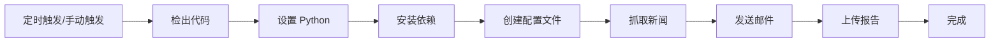

# 🚀 GitHub Actions 自动化部署指南

## 📋 目录

1. [什么是 GitHub Actions](#什么是-github-actions)
2. [为什么使用 GitHub Actions](#为什么使用-github-actions)
3. [快速设置步骤](#快速设置步骤)
4. [配置说明](#配置说明)
5. [常见问题](#常见问题)
6. [高级功能](#高级功能)

---

## 什么是 GitHub Actions

GitHub Actions 是 GitHub 提供的**免费 CI/CD 服务**，可以自动运行您的代码：

- ✅ **完全免费**（公开仓库无限制，私有仓库每月 2000 分钟）
- ✅ **云端运行**（24/7 在线，不需要本地电脑开机）
- ✅ **自动执行**（定时触发或手动触发）
- ✅ **易于配置**（YAML 格式配置文件）

---

## 为什么使用 GitHub Actions

### 对比本地 Crontab

| 特性 | GitHub Actions | 本地 Crontab |
|------|---------------|-------------|
| 需要电脑开机 | ❌ 不需要 | ✅ 需要 |
| 费用 | 免费 | 电费 |
| 24/7 运行 | ✅ 是 | ❌ 否（需要不关机）|
| 日志查看 | ✅ 网页查看 | 需要登录服务器 |
| 维护成本 | ✅ 低 | 需要维护 |
| 错误通知 | ✅ 邮件通知 | 需要配置 |

**结论**：GitHub Actions 是最佳选择！

---

## 快速设置步骤

### 步骤 1：创建 GitHub 仓库

1. 登录 [GitHub](https://github.com)
2. 点击右上角 "+" → "New repository"
3. 填写仓库名称（如 `news-scraper`）
4. 选择 **Public**（公开仓库免费无限制）或 **Private**
5. 点击 "Create repository"

### 步骤 2：上传项目代码

```bash
cd /tmp/news_scraper

# 初始化 Git（如果还没有）
git init

# 添加远程仓库
git remote add origin https://github.com/你的用户名/news-scraper.git

# 添加所有文件
git add .

# 提交
git commit -m "Initial commit: 新闻抓取项目"

# 推送到 GitHub
git push -u origin main
```

### 步骤 3：配置 GitHub Secrets（重要！）

Secrets 用于存储敏感信息（如邮箱密码），不会暴露在代码中。

**操作步骤**：

1. 进入 GitHub 仓库页面
2. 点击 **Settings** (设置)
3. 左侧菜单点击 **Secrets and variables** → **Actions**
4. 点击 **New repository secret**
5. 添加以下 4 个 Secrets：

#### Secret 1: `SENDER_EMAIL`
```
Name: SENDER_EMAIL
Value: 1310787428@qq.com
```

#### Secret 2: `SENDER_PASSWORD`
```
Name: SENDER_PASSWORD
Value: qlvbckkqaszvhcga
```

#### Secret 3: `RECIPIENTS`
```
Name: RECIPIENTS
Value: ["L30h5876i_185_@outlook.com"]
```
**注意**：必须是 JSON 数组格式，包含方括号和引号！

#### Secret 4: `SMTP_TYPE`
```
Name: SMTP_TYPE
Value: qq
```

**完成后应该有 4 个 Secrets**：
- ✅ SENDER_EMAIL
- ✅ SENDER_PASSWORD
- ✅ RECIPIENTS
- ✅ SMTP_TYPE

### 步骤 4：启用 GitHub Actions

1. 进入仓库的 **Actions** 标签页
2. 如果提示启用 Workflows，点击 "I understand my workflows, go ahead and enable them"
3. 查看是否有 "Daily News Scraper" workflow

### 步骤 5：测试运行

#### 方法 1：手动触发（推荐先测试）

1. 进入 **Actions** 标签
2. 左侧选择 "Daily News Scraper"
3. 点击右侧 "Run workflow" 按钮
4. 点击绿色 "Run workflow" 确认
5. 等待几秒，刷新页面
6. 点击正在运行的任务查看实时日志

#### 方法 2：等待定时触发

- 每天 UTC 0:00（北京时间 8:00）自动运行
- 无需任何操作

---

## 配置说明

### 文件结构

```
.github/
└── workflows/
    ├── daily-news.yml          # 完整版（推荐）
    └── daily-news-simple.yml   # 简化版
```

### 定时任务时间说明

在 workflow 文件中修改 cron 表达式：

```yaml
schedule:
  - cron: '0 0 * * *'  # 分钟 小时 日 月 星期
```

**常用时间配置**：

| 时间 | Cron 表达式 | 说明 |
|------|------------|------|
| 每天 8:00 (北京) | `'0 0 * * *'` | UTC 0:00 |
| 每天 9:00 (北京) | `'0 1 * * *'` | UTC 1:00 |
| 每天 12:00 (北京) | `'0 4 * * *'` | UTC 4:00 |
| 每天 18:00 (北京) | `'0 10 * * *'` | UTC 10:00 |
| 每天 20:00 (北京) | `'0 12 * * *'` | UTC 12:00 |

**时区转换**：北京时间 = UTC + 8

### 修改执行时间

编辑 `.github/workflows/daily-news.yml`：

```yaml
on:
  schedule:
    - cron: '0 1 * * *'  # 改为北京时间 9:00
```

提交并推送：
```bash
git add .github/workflows/daily-news.yml
git commit -m "修改执行时间为早上9点"
git push
```

---

## GitHub Actions 工作流程



### 详细执行步骤

1. **触发**：定时或手动触发
2. **环境准备**：
   - 使用 Ubuntu 虚拟机
   - 安装 Python 3.9
   - 安装项目依赖
3. **配置**：
   - 从 Secrets 读取邮箱配置
   - 创建 `email_config.json`
4. **执行**：
   - 运行 `daily_news_task.py`
   - 抓取新闻
   - 发送邮件
5. **保存**：
   - 上传生成的报告
   - 保存执行日志

---

## 常见问题

### Q1: 为什么要使用 Secrets？

**答**：保护敏感信息！
- ❌ 不要把邮箱密码直接写在代码里
- ✅ 使用 Secrets 加密存储
- Secrets 不会显示在日志中
- 别人看不到您的密码

### Q2: 如何查看执行日志？

1. 进入仓库 **Actions** 标签
2. 点击具体的运行记录
3. 展开各个步骤查看详细日志
4. 可以下载 artifacts 查看生成的报告

### Q3: 任务执行失败怎么办？

**检查步骤**：
1. 查看 Actions 页面的错误信息
2. 确认 Secrets 配置是否正确
3. 检查 `RECIPIENTS` 格式是否为 JSON 数组
4. 查看 requirements.txt 依赖是否完整

**常见错误**：

#### 错误 1：Secrets 未配置
```
Error: The SENDER_EMAIL variable is not set
```
**解决**：按步骤 3 配置 Secrets

#### 错误 2：RECIPIENTS 格式错误
```
JSONDecodeError: Expecting value
```
**解决**：确保 RECIPIENTS 格式为 `["email@example.com"]`

#### 错误 3：依赖安装失败
```
ERROR: Could not find a version that satisfies the requirement
```
**解决**：检查 requirements.txt 文件是否存在且格式正确

### Q4: 可以修改执行时间吗？

可以！编辑 `.github/workflows/daily-news.yml` 中的 cron 表达式。

**示例**：改为每天早上 6:00（北京时间）
```yaml
schedule:
  - cron: '0 22 * * *'  # UTC 22:00 = 北京 6:00
```

### Q5: 如何手动触发任务？

1. 进入 **Actions** 标签
2. 选择 workflow
3. 点击 "Run workflow"
4. 确认运行

### Q6: 会扣费吗？

**公开仓库**：完全免费，无限制
**私有仓库**：每月 2000 分钟免费额度
- 每次运行约 2-5 分钟
- 每天运行 1 次，每月约 30 次
- 总计约 150 分钟/月
- **远低于免费额度**

### Q7: 可以添加多个收件人吗？

可以！修改 RECIPIENTS Secret：
```json
["email1@example.com", "email2@example.com", "email3@example.com"]
```

### Q8: 如何关闭自动运行？

**方法 1**：禁用 Workflow
1. 进入 Actions 标签
2. 选择 workflow
3. 点击右上角 "..." → "Disable workflow"

**方法 2**：删除 workflow 文件
```bash
git rm .github/workflows/daily-news.yml
git commit -m "禁用自动运行"
git push
```

### Q9: 邮件发送失败怎么办？

**检查项**：
1. Secrets 中的邮箱地址和授权码是否正确
2. 授权码是否是邮箱的授权码（不是登录密码）
3. QQ 邮箱是否开启了 SMTP 服务
4. 查看 Actions 日志中的详细错误信息

### Q10: 可以发送到多个不同类型的邮箱吗？

可以！SMTP_TYPE 只影响发件邮箱，收件邮箱可以是任意类型：
```json
["qq@qq.com", "gmail@gmail.com", "outlook@outlook.com"]
```

---

## 高级功能

### 1. 添加通知（失败时发送通知）

在 workflow 末尾添加：

```yaml
- name: 发送失败通知
  if: failure()
  uses: dawidd6/action-send-mail@v3
  with:
    server_address: smtp.qq.com
    server_port: 465
    username: ${{ secrets.SENDER_EMAIL }}
    password: ${{ secrets.SENDER_PASSWORD }}
    subject: '❌ 新闻抓取任务失败'
    body: |
      任务执行失败，请检查 GitHub Actions 日志。
      运行编号: ${{ github.run_number }}
      时间: ${{ github.event.head_commit.timestamp }}
    to: ${{ secrets.SENDER_EMAIL }}
```

### 2. 多时段执行

每天执行多次：

```yaml
schedule:
  - cron: '0 0 * * *'   # 早上 8:00
  - cron: '0 4 * * *'   # 中午 12:00
  - cron: '0 10 * * *'  # 晚上 18:00
```

### 3. 工作日执行

只在工作日执行：

```yaml
schedule:
  - cron: '0 0 * * 1-5'  # 周一到周五
```

### 4. 缓存依赖（加速执行）

```yaml
- uses: actions/setup-python@v4
  with:
    python-version: '3.9'
    cache: 'pip'  # 启用 pip 缓存
```

### 5. 条件执行

只在主分支执行：

```yaml
jobs:
  run-news-task:
    if: github.ref == 'refs/heads/main'
    runs-on: ubuntu-latest
```

### 6. 矩阵构建（多版本测试）

```yaml
strategy:
  matrix:
    python-version: ['3.8', '3.9', '3.10']
```

---

## 监控和维护

### 查看执行历史

1. 进入 **Actions** 标签
2. 查看所有运行记录
3. 绿色 ✅ = 成功
4. 红色 ❌ = 失败

### 下载生成的报告

1. 点击具体的运行记录
2. 滚动到底部 "Artifacts"
3. 下载 `news-report` 和 `logs`

### 邮件通知

GitHub 会在 workflow 失败时自动发送邮件通知到您的 GitHub 注册邮箱。

---

## 安全建议

### ✅ 推荐做法

1. ✅ 使用 Secrets 存储敏感信息
2. ✅ 定期更换邮箱授权码
3. ✅ 公开仓库不要包含配置文件
4. ✅ 使用 `.gitignore` 忽略配置文件

### ❌ 避免做法

1. ❌ 不要把密码写在代码里
2. ❌ 不要提交 `email_config.json` 到 Git
3. ❌ 不要在日志中打印敏感信息
4. ❌ 不要把私钥上传到 GitHub

### .gitignore 文件

确保以下文件不被提交：

```gitignore
# 配置文件（包含敏感信息）
email_config.json
cron_config.json
*_config.json

# 输出文件
output/
logs/
*.log

# 缓存
__pycache__/
*.pyc
.pytest_cache/

# 环境
venv/
.env
```

---

## 完整示例

### 项目结构

```
news-scraper/
├── .github/
│   └── workflows/
│       ├── daily-news.yml          # GitHub Actions 配置
│       └── daily-news-simple.yml   # 简化版
├── news_scraper_hybrid.py          # 新闻抓取脚本
├── email_sender.py                 # 邮件发送脚本
├── daily_news_task.py              # 每日任务脚本
├── config.json                     # 新闻配置
├── requirements.txt                # Python 依赖
├── .gitignore                      # Git 忽略文件
└── README.md                       # 项目说明
```

### 完整操作流程

```bash
# 1. 初始化 Git
git init

# 2. 创建 .gitignore
cat > .gitignore << EOF
email_config.json
cron_config.json
output/
logs/
__pycache__/
*.pyc
EOF

# 3. 添加文件
git add .

# 4. 提交
git commit -m "Initial commit: 新闻抓取项目"

# 5. 关联远程仓库
git remote add origin https://github.com/你的用户名/news-scraper.git

# 6. 推送到 GitHub
git push -u origin main
```

---

## 测试检查清单

部署前请确认：

- [ ] GitHub 仓库已创建
- [ ] 代码已推送到 GitHub
- [ ] 4 个 Secrets 已配置
  - [ ] SENDER_EMAIL
  - [ ] SENDER_PASSWORD
  - [ ] RECIPIENTS（JSON 数组格式）
  - [ ] SMTP_TYPE
- [ ] `.github/workflows/daily-news.yml` 文件存在
- [ ] Actions 已启用
- [ ] 手动触发测试成功
- [ ] 邮件发送成功

---

## 获取帮助

### 官方文档
- [GitHub Actions 文档](https://docs.github.com/en/actions)
- [Workflow 语法](https://docs.github.com/en/actions/using-workflows/workflow-syntax-for-github-actions)

### 调试技巧
1. 使用 `workflow_dispatch` 手动触发测试
2. 查看详细日志排查问题
3. 下载 artifacts 查看生成的文件
4. 使用 `continue-on-error: true` 允许部分失败

### 常用资源
- [Cron 表达式生成器](https://crontab.guru/)
- [GitHub Actions Marketplace](https://github.com/marketplace?type=actions)

---

## 总结

✅ **优势**
- 完全免费（公开仓库）
- 无需本地电脑 24 小时开机
- 自动执行，无需维护
- 云端运行，稳定可靠
- 日志完整，便于调试

✅ **适用场景**
- 个人新闻订阅
- 定期报告生成
- 自动化数据收集
- 定时任务执行

🎉 **开始使用 GitHub Actions，享受自动化的便利！**

---

---

## 更新日志

### v1.0.1 (2025-10-01)
- ✅ **修复**: 升级 `actions/upload-artifact` 从 v3 到 v4（v3 已弃用）
- ✅ **更新**: 升级 `actions/checkout` 从 v3 到 v4
- ✅ **更新**: 升级 `actions/setup-python` 从 v4 到 v5
- 🎯 **影响**: 解决 GitHub Actions 弃用警告，确保长期稳定运行

### v1.0.0 (2025-10-01)
- 🎉 初始版本发布

---

**最后更新**: 2025-10-01  
**作者**: GitHub Copilot  
**版本**: 1.0.1
